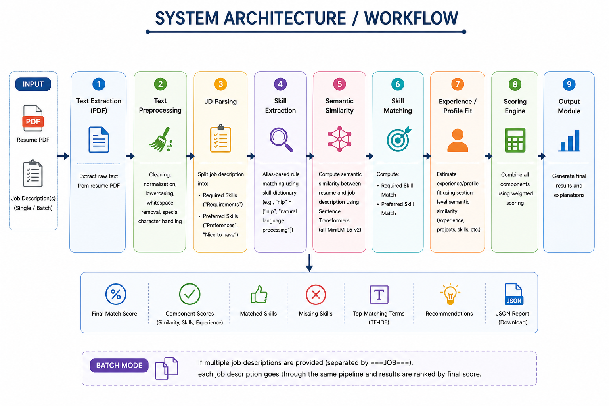
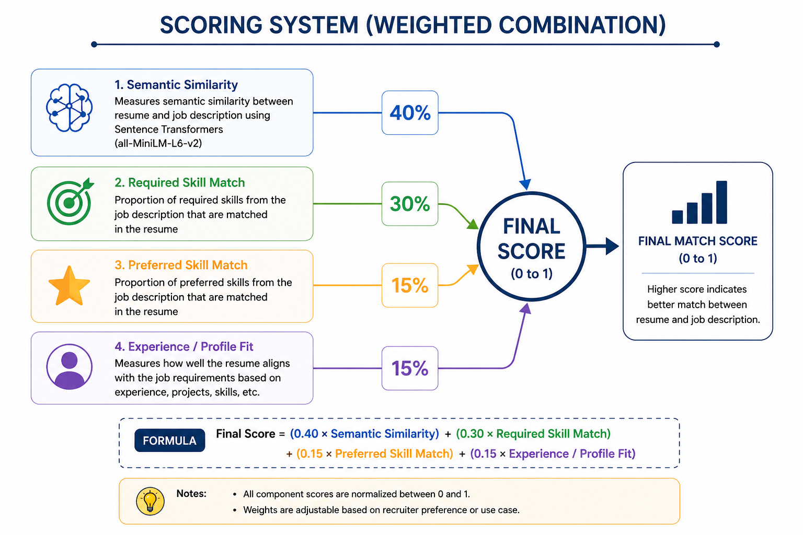
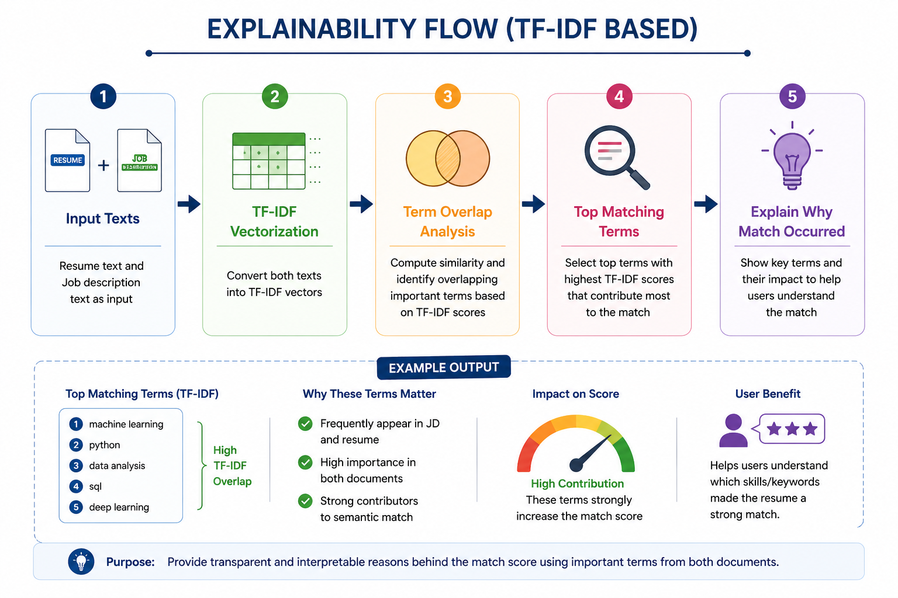
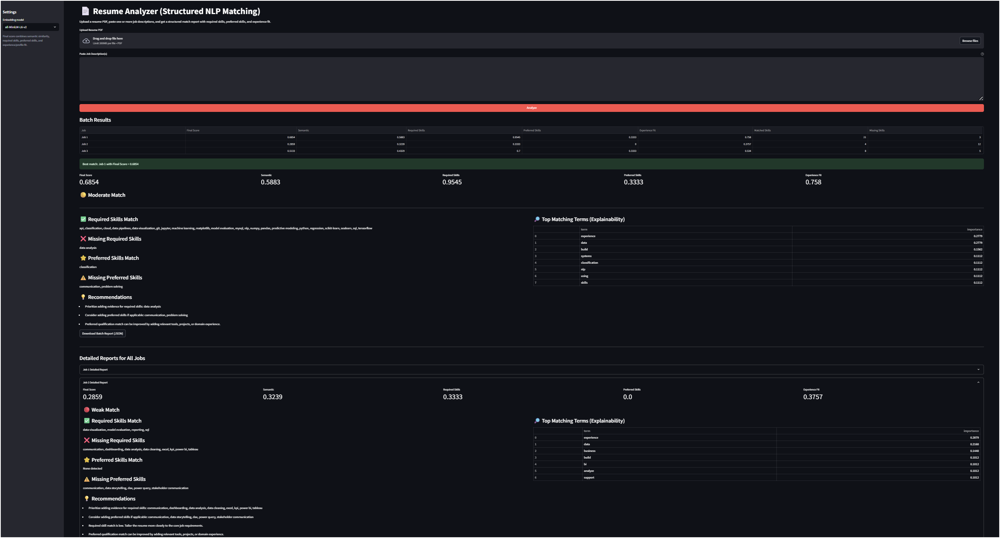

# Resume Analyzer

## Overview

A structured NLP resume analyzer that compares a resume PDF against one or multiple job descriptions. The system uses semantic similarity, required skill matching, preferred skill matching, experience/profile fit, explainability, recommendations, and batch ranking.

## Features

- Upload a resume PDF
- Compare against one or multiple job descriptions
- Batch mode using `===JOB===`
- Semantic similarity using Sentence Transformers
- Required skills and preferred skills matching
- Experience/profile fit scoring
- Structured recruiter-aware final score
- Recommendation block for resume improvement
- Downloadable JSON report
- Explainability through top matching TF-IDF terms
- Streamlit-based interactive UI
- Lightweight evaluation script
- Recruiter-style match labeling: Strong / Moderate / Weak
- Expanded Data Analyst skill coverage including SQL, BI tools, Excel, KPIs, ETL, and reporting

## Tech Stack

- Python
- Streamlit
- Sentence Transformers
- scikit-learn
- PyMuPDF
- NumPy
- Pandas

## Project Structure

```bash
resume-analyzer/
│
├── analyzer.py
├── app.py
├── evaluation.py
├── evaluation_results.csv
├── README.md
├── requirements.txt
│
├── assets/
│   └── app_output.png
│
├── sample_data/
│   ├── sample_resume.pdf
│   └── sample_job_description.txt
│
└── notebooks/
    └── prototype.ipynb
 ```   

## Problem Statement

Recruiters and applicants often need to compare resumes against job descriptions, but manual matching can be slow and inconsistent. Basic keyword-based systems may miss strong candidates when the wording differs between the resume and job description.
This project builds a structured NLP-based resume analyzer that evaluates a resume using semantic similarity, required skills, preferred skills, and experience/profile fit.

## Approach

The system works in the following stages:

1. Extract text from the uploaded resume PDF
2. Clean and normalize resume and job description text
3. Split the job description into required and preferred requirement sections
4. Extract skills using an alias-based rule matching system
5. Compute semantic similarity between the resume and job description using a pretrained Sentence Transformer model
6. Compute required skill match and preferred skill match separately
7. Estimate experience/profile fit using section-level signals
8. Combine all scores into a structured recruiter-aware final score
9. Generate recommendations based on missing skills and weaker alignment areas
10. Display matched skills, missing skills, top matching terms, and downloadable JSON reports

## System Architecture



## Scoring Logic

The final score is a structured combination of multiple factors:

- Semantic Similarity
- Required Skill Match
- Preferred Skill Match
- Experience/Profile Fit

Default weighting:

- Semantic similarity: 40%
- Required skill match: 30%
- Preferred skill match: 15%
- Experience/profile fit: 15%

All scores are normalized between 0 and 1.



## Explainability

To make the output more interpretable, the app also shows:
- Matched skills
- Missing skills
- Top matching TF-IDF terms between resume and job description
This helps explain why a resume received a certain score instead of producing only a black-box output.



## Batch Mode

The app supports comparing one resume against multiple job descriptions.
To use batch mode, paste multiple job descriptions into the input box and separate them using:

```text
===JOB===
```
The app will rank the jobs and identify the best match.

## Evaluation

A lightweight evaluation script (`evaluation.py`) is included to benchmark the system on manually labeled High / Medium / Low match cases.

The expanded evaluation set includes:
- Strong Data Analyst / Data Science matches
- Moderate partial-match cases
- Weak mismatched-role cases such as frontend, marketing, and HR examples

The system is evaluated using:

- Accuracy
- Precision
- Recall
- F1-score

The script generates a classification report comparing predicted vs expected match levels.

Results are saved to `evaluation_results.csv`.

## How to Run

- Requires Python 3.9+

Install dependencies:

```bash
pip install -r requirements.txt
```

Run the Streamlit app:

```bash
streamlit run app.py
```

Run evaluation:

```bash
python evaluation.py
```

You can test the app using the files inside the `sample_data/` folder:

- `sample_resume.pdf`
- `sample_job_description.txt`

## Example Output

Below is a sample app result:


## Future Improvements

- Extend the system to rank multiple resumes against a single job description
- Improve skill synonym coverage further
- Add section-aware resume parsing (experience, education)
- Improve experience modeling (years, progression)
- Add LLM-based explanation layer
- Improve handling for noisy PDF parsing cases

## Author

Ankan Mandal